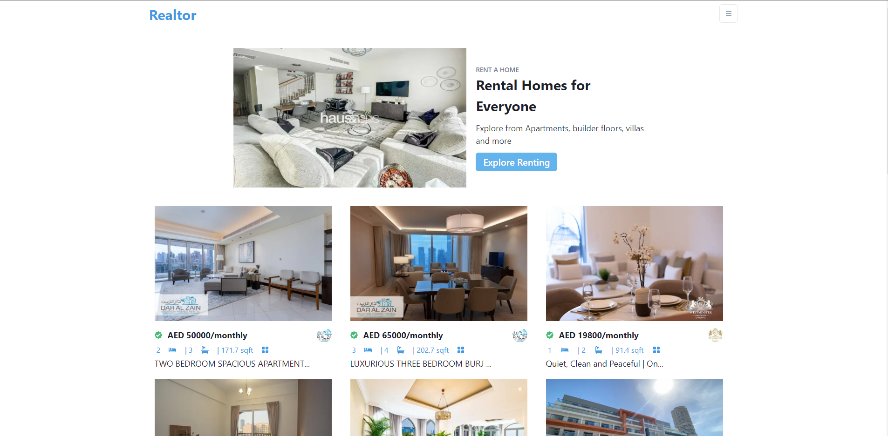

# NextJS Realtor App

A real estate property listing website that lets users find properties for sale and for rent in the United Arab Emirates(UAE). 
The user can view a few featured listings on the home page grouped by purpose(for sale or for rent). 
The app then provides the ability to narrow down the search results by enabling filtering by price range, square footage, number of rooms and bathrooms, furnishing, type of property and location while also allowing for sorting of properties by price, listing age, verification status and city score. 
The user can then click on one of the properties to view detailed information on that property as well as an image carousel of high quality pictures of the property's interior.

This web app was built with:
* NextJS
* React Hooks
* Axios
* Chakra UI
* Rapid API

Click <a href="https://adtx.github.io/realtor_nextjs/" target="_blank">here</a> to try out the app for yourself.
